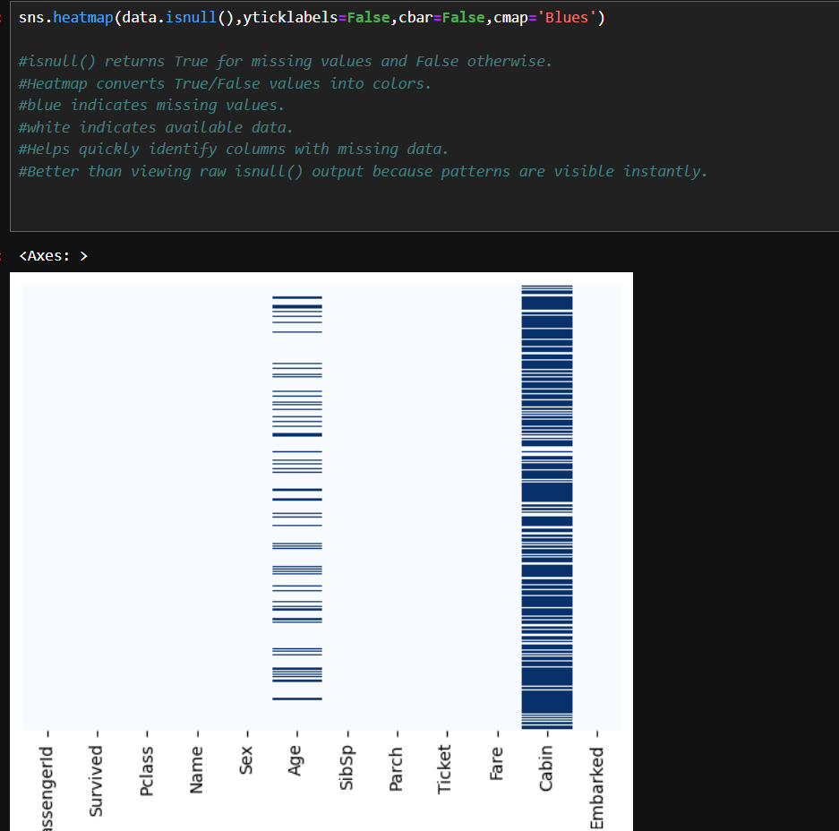
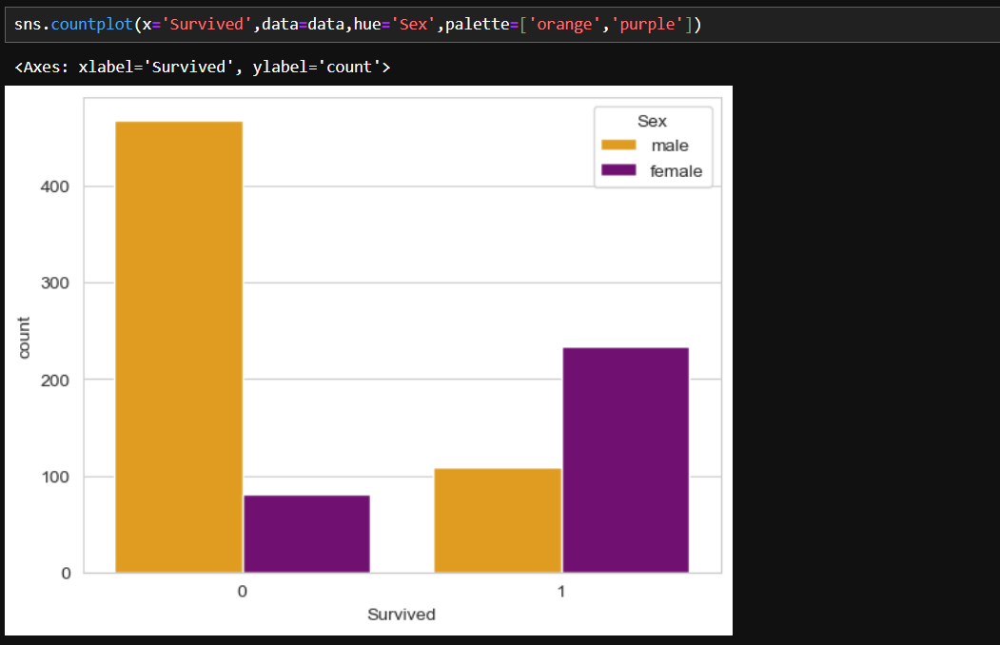
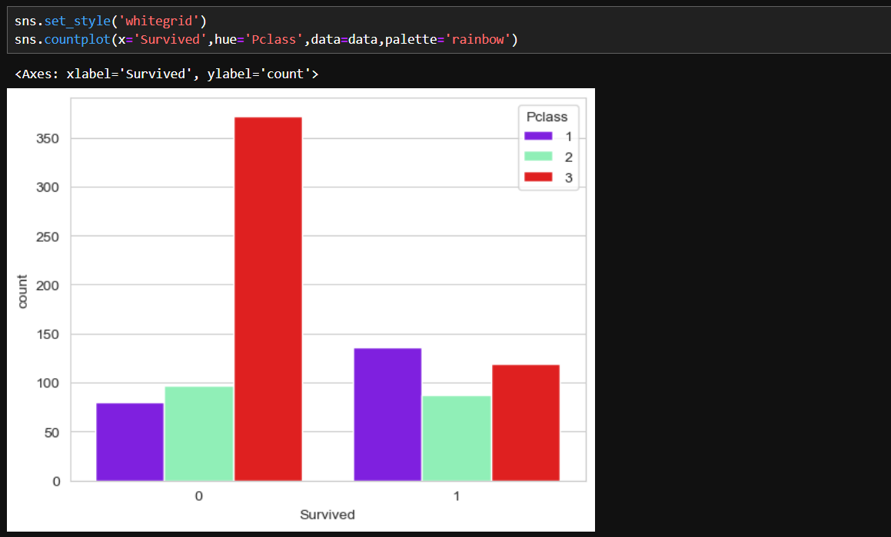
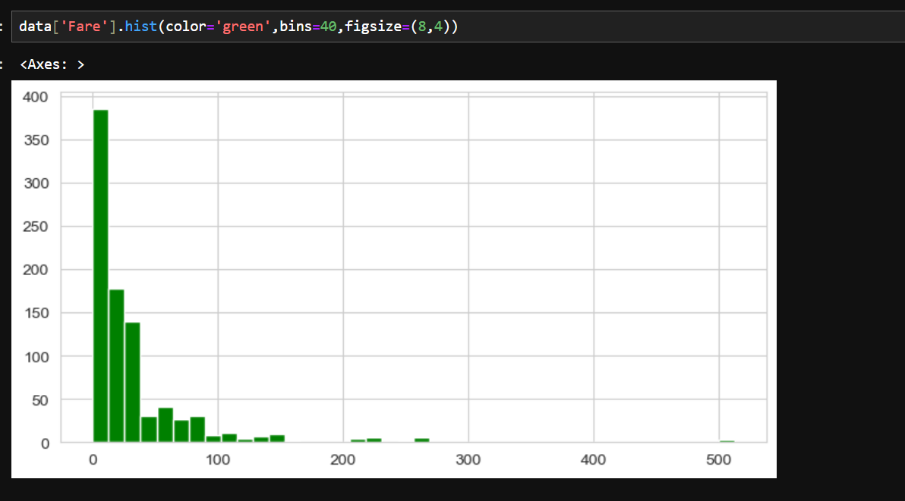

# Titanic Survival Prediction

## Project Overview
This project predicts whether a passenger survived the Titanic disaster using Logistic Regression.

## Dataset
- Titanic Dataset from Kaggle
- 891 passenger records

## Workflow
1. Data Exploration (EDA)
2. Missing Value Handling
3. Feature Engineering
4. Categorical Variable Encoding
5. Train-Test Split
6. Logistic Regression Model Training
7. Model Evaluation

## Technologies Used
- Python
- Pandas
- NumPy
- Matplotlib
- Seaborn
- Scikit-Learn

## Model Performance
Accuracy: 78.36%

## Learning Outcomes
- Data Cleaning
- Exploratory Data Analysis
- Feature Engineering
- Logistic Regression
- Confusion Matrix
- Accuracy Evaluation

## Visualizations

### Missing Values Heatmap

### Survival by Gender

### Survival by Passenger Class

### Fare Distribution

